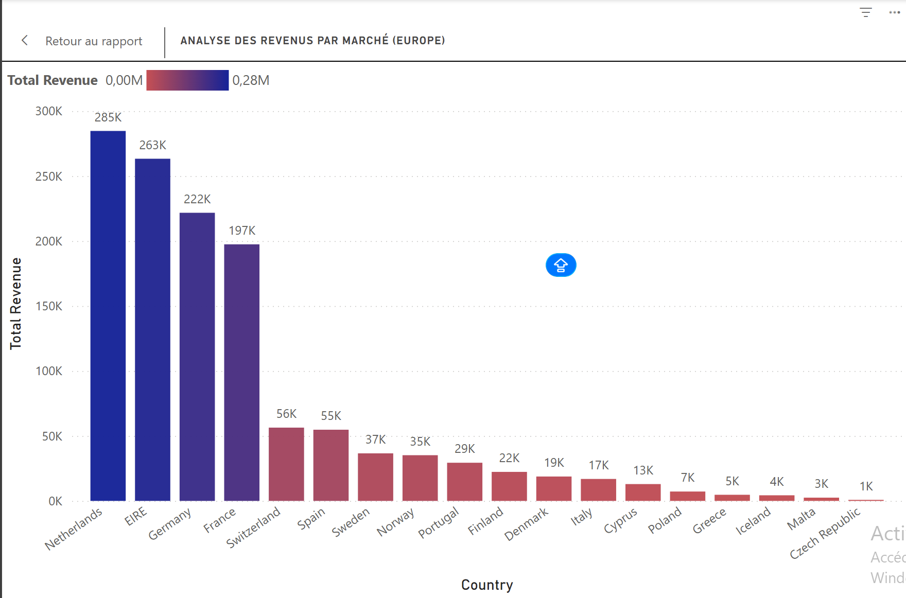

# 📊 Analyse de Risque E-commerce - Marché Europe

### 🎯 Objectif
Identifier la concentration du chiffre d'affaires et les marchés à faible rentabilité pour optimiser les coûts logistiques.

### 🛠️ Outils utilisés
* **Power BI Desktop**
* **Langage DAX** (Mesure Total Revenue)
* **Data Visualization** (Formatage conditionnel)

### 📈 Aperçu du Dashboard

### 🔍 Conclusions Business
Le top 4 (Pays-Bas, Irlande, Allemagne, France) génère la quasi-totalité des revenus. Les pays en rouge présentent un risque de rentabilité si les frais d'expédition sont fixes.
